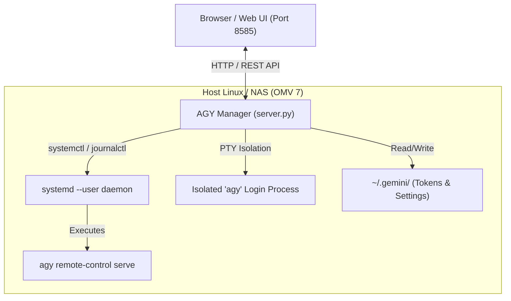

# 🌌 Antigravity (AGY) Manager

[](https://www.docker.com/)
[](https://www.openmediavault.org/)
[](https://www.python.org/)
[](LICENSE)

> A modern, lightweight, beautiful Web Management Dashboard for [Google Antigravity CLI (`agy`)](https://github.com/google/antigravity) on Linux servers, Home NAS (OpenMediaVault, TrueNAS, Unraid), and Docker hosts.

---

## ✨ Features

- 👤 **Multi-Account & Profile Manager:**
  - **1-Click Google OAuth Login:** Generates authorized Google OAuth URL via a background isolated pseudo-terminal (PTY) without stopping or interrupting your running daemon!
  - **Instant Account Switching:** Switch between personal and work Google accounts with 1 click.
  - **Manual Token Import:** Easily paste `antigravity-oauth-token` JSON from another machine.
- 📡 **CLI Remote-Control Daemon Management:**
  - **State-Aware Actions:** Dynamically shows `Start` when stopped, or `Stop` & `Restart` when active.
  - **Custom Confirmation Modals:** Dark-themed confirmation dialogs for dangerous actions (`Stop`, `Restart`, `Switch Profile`, `Delete Profile`).
  - **Resource Monitoring:** Real-time PID, Memory (RAM), CPU time, and uptime tracking.
- 📊 **Real-time Model Quotas & Usage:**
  - Live quota tracking for **Gemini Models** and **Claude & GPT models** directly from `agy /usage`.
  - **Configurable Interval Pull:** Automatically refresh quotas every `15s`, `30s`, `1m (default)`, `2m`, `5m`, or manual. Preferences persisted via `localStorage`.
  - **Low Token / Quota Alert System:** Prominent alert banner, badge, and red pulsing glow whenever any model quota drops below **20%**.
  - **Token Expiry Detection:** Alerts when access tokens are near expiration or expired.
- ⚙️ **Official Permission Mode Selector:**
  - Select between all 4 official `toolPermission` modes supported by `agy`:
    - `⚡ always-proceed`: Full Auto (adds `--dangerously-skip-permissions` to daemon).
    - `🤖 agent-decides`: AI evaluates action safety before execution.
    - `🛡️ request-review`: Always asks for user approval for file/shell operations.
    - `📦 proceed-in-sandbox`: Executes safely within a restricted sandbox.
- 📜 **Live Journalctl Logs:**
  - Stream real-time logs from `journalctl --user -u antigravity-cli-daemon.service` with auto-scroll toggle.
- 🎨 **Sleek Modern Dark UI:**
  - Tailored for NAS and developer environments, responsive on mobile and desktop.

---

## 🏗️ Architecture



---

## 🚀 Quick Start

### Method 1: Docker Compose (Recommended)

1. **Clone the repository:**
   ```bash
   git clone https://github.com/nchungdev/antigravity-manager.git
   cd antigravity-manager
   ```

2. **Configure your environment:**
   ```bash
   cp .env.example .env
   # Edit .env to set your HOST_USER (e.g. debian, ubuntu, or your username)
   nano .env
   ```

3. **Start the service:**
   ```bash
   docker compose up -d
   ```

4. Open your browser at **`http://<SERVER-IP>:8585`**.

---

### Method 2: 1-Click Interactive Installer

Run the automated installer on Debian, Ubuntu, OpenMediaVault, or any Linux distribution:

```bash
git clone https://github.com/nchungdev/antigravity-manager.git
cd antigravity-manager
chmod +x scripts/install.sh
./scripts/install.sh
```

---

### Method 3: Native Systemd User Service (No Docker)

```bash
# 1. Copy script to user home
mkdir -p ~/.agy-manager
cp server.py ~/.agy-manager/server.py

# 2. Create systemd user service
mkdir -p ~/.config/systemd/user
cat <<EOF > ~/.config/systemd/user/agy-manager.service
[Unit]
Description=Antigravity Manager Web Dashboard
After=network.target

[Service]
Type=simple
Environment=PORT=8585
Environment=HOST_USER=%u
Environment=USER_HOME=%h
ExecStart=/usr/bin/python3 -u %h/.agy-manager/server.py
Restart=always
RestartSec=5

[Install]
WantedBy=default.target
EOF

# 3. Reload and start service
systemctl --user daemon-reload
systemctl --user enable --now agy-manager.service
loginctl enable-linger $USER
```

---

## 🌐 OpenMediaVault 7 (OMV) Setup

If you are running OpenMediaVault with the **Compose Plugin**:
1. Go to **Services > Compose > Files**.
2. Click **+ (Add)** and create a new file named `agy-manager`.
3. Paste the contents of `docker-compose.yml`.
4. Adjust `HOST_USER` and volume paths to match your NAS user account.
5. Click **Up** to launch the container.

---

## ⚙️ Environment Variables

| Variable | Default | Description |
|---|---|---|
| `PORT` | `8585` | Port on which Web UI will listen |
| `HOST_USER` | auto-detected | Username running the `agy` CLI daemon on host |
| `USER_HOME` | `/home/${HOST_USER}` | Home directory of the host user |
| `AGY_BIN` | auto-detected | Path to `agy` binary (`~/.local/bin/agy`) |
| `SYSTEMD_SERVICE` | `antigravity-cli-daemon.service` | Name of the user systemd service |
| `TZ` | `Asia/Ho_Chi_Minh` | System timezone |

---

## 📄 License

This project is licensed under the MIT License - see the [LICENSE](LICENSE) file for details.
